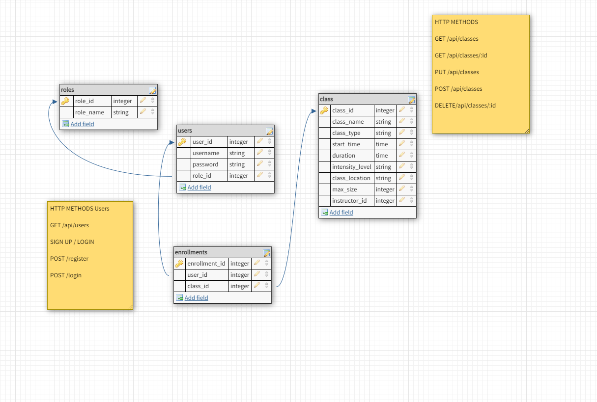

# Anywhere Fitness

# Problem Statment: [link to mvp goals](https://github.com/ft-anywherefitness-2/backend/blob/bryan-guner/notes/assignment.md)

## Table of contents

- **[Overview](#overview)** 
- **[API Endpoints](#api-endpoints)** 

## Overview

AnywhereFitness is the all-in-one solution to meet your “on-location” fitness class needs.
AnywhereFitness makes it painless for Instructors and Clients alike to hold and attend Fitness
classes wherever they might be held.

## API endpoints

### **_Authentication (for login)_**

| Method        | Endpoint           | Body (required)                       | Body (optional) | Notes                                             |
| ------------- | ------------------ | ------------------------------------- | --------------- | ------------------------------------------------- |
| register POST | /api/auth/register | name, email, username, password, role | N/A             | Creates a new user object in the database.        |
| login POST    | /api/auth/login    | username, password                    | N/A             | Returns a welcome message and the JSON Web Token. |

### **_Additional athunetication for Instructor_**

| Method               | Endpoint                         | Body (required)                                                                     | Body (optional) | Notes                                                                                                                                                    |
| -------------------- | -------------------------------- | ----------------------------------------------------------------------------------- | --------------- | -------------------------------------------------------------------------------------------------------------------------------------------------------- |
| Add class POST       | /api/auth/instructor/classes     | name, instructor_name, type, intensity,location, date, max_size, duration, signedUp | N/A             | Creates a new class object in the database. Date has to string in "04/19/2020" format. Duration is a float and signedUp is a boolean(false as a default) |
| Update Class PUT     | /api/auth/instructor/classes/:id | any of the field                                                                    | N/A             | Updates the class with given Id                                                                                                                          |
| Removes Class DELETE | /api/auth/instructor/classes/:id | any of the field                                                                    | N/A             | Deletes the class with given Id                                                                                                                          |

### **_Endpoints for the Users_**

| Method                        | Endpoint                           | Body (required) | Body (optional) | Notes                                                            |
| ----------------------------- | ---------------------------------- | --------------- | --------------- | ---------------------------------------------------------------- |
| get classes GET               | /api/auth/users/classes            | N/A             | N/A             | Fetches all the classes from the database                        |
| get classes by Id GET         | /api/auth/users/classes/:id        | id              | N/A             | Fetches the class with given Id.                                 |
| get classes by Location GET   | /api/auth/users/classes/location   | location        | N/A             | Gets all the class in that location                              |
| get classes by intensity GET  | /api/auth/users/classes/intensity  | intensity       | N/A             | Gets all the class in that intensity. "low", "medium", or "high" |
| get classes by duration GET   | /api/auth/users/classes/duration   | duration        | N/A             | Gets all the class of that duration. Has to be double.           |
| get classes by type GET       | /api/auth/users/classes/type       | type            | N/A             | Gets all the class of that type.                                 |
| get classes by instructor GET | /api/auth/users/classes/instructor | instructor_name | N/A             | Gets all the class by that instructor.                           |

# Full Stack Build Week (Anywhere Fitness)

# Links:

[Task List](https://www.notion.so/b594fe1487234f96b5dcf19c4a258218)

[Copy of Product Vision Document](https://www.notion.so/Copy-of-Product-Vision-Document-69eb43351a72457e956caf79409d7d04)

[Anywhere Fitness](https://www.notion.so/Anywhere-Fitness-ba5d9993f953483a860db08ba0e6ab78)

[Build Week Student Guide (Full-time)](https://www.notion.so/Build-Week-Student-Guide-Full-time-5205d3157be141849bb5f99e3f93c6c6)

## ☝️ **Pitch**

These days, fitness classes can be held anywhere- a park, an unfinished basement or a garage- not just at a traditional gym. Certified fitness instructors need an easy way to take the awkwardness out of attendance taking and client payment processing.

While you could use several mobile apps to accomplish this, **Anywhere Fitness** is the all-in-one solution to meet your “on-location” fitness class needs. AnywhereFitness makes it painless for Instructors and Clients alike to hold and attend Fitness classes wherever they might be held.

Instructors can take attendance, request and process payments, create virtual “punch passes” for each type of class offered, alert clients of cancellations or location changes and so much more. Clients can easily find out information on classes - location, class size, start time and duration, as well as reschedule or cancel an upcoming appointment or reservation right from the mobile app.

## ✅ **MVP**

1. User can create/register as a `client` and login with the registered credentials.

2. User can create/register as an `instructor` by entering an additional Auth Code during signup, and can login with the registered credentials.

3. `client` and `instructor` are both presented with the appropriate on-boarding walkthrough on first sign-in, with an option to skip it.

4. Authenticated `Instructor` can create update and delete a `class`. At a minimum, each `class` must have the following properties:

- `Name`
- `Type`
- `Start time`
- `Duration`
- `Intensity level`
- `Location`
- `Current number of registered attendees`
- `Max class size`

5. Authenticated `client` can search for available classes. At a minimum, they must be able to search by the following criteria:

- `class time`
- `class date`
- `class duration`
- `class type`
- `intensity level`
- `class location`

6. Authenticated `instructor` can create virtual punch pass categories for each type of group fitness class they offer (yoga, insanity, RIPPED, pilates, etc.)

7. Authenticated `user` can reserve a spot in a `class` with available seats open, and can reschedule or cancel their current `reservation` from the mobile app.

## 🏃‍♀️**Stretch**

1. Implement payments using PayPal, Stripe or another 3rd party API.

### The Essentials

---

[Copy of Full Time Schedule and Milestones](https://www.notion.so/b19cfdc059ac4f3db92624c589944fbd)

[Copy of Build Week Rubrics & Role Descriptions ](https://www.notion.so/Copy-of-Build-Week-Rubrics-Role-Descriptions-0ea359b931474d01ae69bd477668acd2)

[Copy of Git for Build Sprint](https://www.notion.so/Copy-of-Git-for-Build-Sprint-ceaeebd0c4fd434fb27bf47368faa23c)

### Getting Set Up

---

[Copy of How to set up Trello board for Build Weeks](https://www.notion.so/Copy-of-How-to-set-up-Trello-board-for-Build-Weeks-ea3e636949cb46fb91561e2a198967b6)

- If you're new to Trello, [here's a basic guide to using it.](https://trello.com/en-US/guide/trello-101)

[Copy of How to setup Github Organization for Build Weeks](https://www.notion.so/Copy-of-How-to-setup-Github-Organization-for-Build-Weeks-98efa51cf77e4015a262291d1ce5e815)

[Copy of Web & DS Scaffolding](https://www.notion.so/Copy-of-Web-DS-Scaffolding-22dcb958d84248f6a61756e8680d08fa)

### Planning Your Project as a Team

---

[Copy of Product Vision Document](https://www.notion.so/Copy-of-Product-Vision-Document-9ef09b53d05d4507b5e8674a856dd84b)

[Copy of Product Vision Document (example)](https://www.notion.so/Copy-of-Product-Vision-Document-example-e8df1dd8d83443df9bafdfd25150e6df)

### What's New in Build Week Since You Were Here Last

---

[Copy of FT Build Week Change Log](https://www.notion.so/9bb0cce0c1114b88bc7c18d6607c4b96)

### Peer Reviews

---

### Product Information

---

[Copy of FT Build Week Product Catalog](https://www.notion.so/Copy-of-FT-Build-Week-Product-Catalog-8ee84c0b3901440babe8f22b2565f0a8)

### Front End Marketing Pages

---

Find your product here: [https://github.com/LambdaSchoolBuildWeeks/Unit1Marketing](https://github.com/LambdaSchoolBuildWeeks/Unit1Marketing)

[Copy of Product Vision Document](https://www.notion.so/Copy-of-Product-Vision-Document-ccd5078a397e4e2cba6a2b1f794c08c0)
